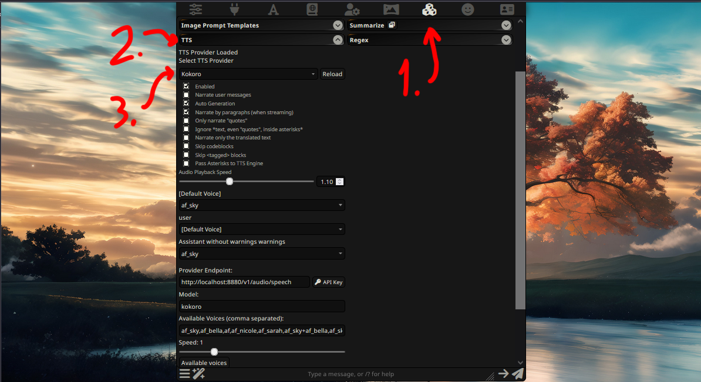

# SillyTavern extension for kokoro tts via Kokoro-FastAPI

I need to make an auto-installer for this.  
But for now, you have to do it "manually".

There WILL be bugs, but it works fine for now.  
Just try not to break it please. haha.

---

## How to install

Get [Kokoro-FastAPI](https://github.com/remsky/Kokoro-FastAPI) running.  
Instructions are on that repo, but I'll copy/paste them for posterity's sake.

Install [Docker Desktop](https://www.docker.com/products/docker-desktop/) and [Git](https://git-scm.com/downloads) (if you don't have it already).

```
git clone https://github.com/remsky/Kokoro-FastAPI.git  
cd Kokoro-FastAPI
```

Once you get that all set up, you need to decide whether you want to run it on CPU or GPU. You only need to run one chunk of these commands. I'm personally using CPU and it's quite fast.

```
# CPU commands
cd docker/cpu
docker compose up --build 
docker run -p 8880:8880 ghcr.io/remsky/kokoro-fastapi-cpu:latest

# GPU Commands
cd docker/gpu
docker compose up --build 
docker run --gpus all -p 8880:8880 ghcr.io/remsky/kokoro-fastapi-gpu:latest
```
Upon running that command, you should see this window pop up:


---

### Now we have to edit SillyTavern a bit.

Download `kokoro.js` from this repo.  
I've included it in the [releases](https://github.com/remghoost/sillytavern-kokoro/releases), but you can `git clone` this repo and copy/paste if over if you'd like.

Then go to `SillyTavern\public\scripts\extensions\tts` and paste `kokoro.js` in there.

Next you need to modify `index.js` in that same folder.  
**Use [Notepad++](https://notepad-plus-plus.org/) / VSCode / etc, NOT notepad/wordpad.**

Add this line somewhere around line 18.   
The exact location doesn't matter, it just needs to be on its own line:

```
import { KokoroTtsProvider } from './kokoro.js';
```

Then around line 90 you should see `const ttsProviders = {`  
Paste this line in that chunk:

```
    Kokoro: KokoroTtsProvider,
```

Now you can launch SillyTavern and select "Kokoro" from the dropdown on the tts extension.



---

I've included some of the default voices but you can add more of them if you'd like (they're located in `Kokoro-FastAPI\Kokoro-82M\voices`). You'll add them on line 18 in `kokoro.js`. You'll have to restart SillyTavern after adding more of them.

I've also included a few merges that I'm a fan of.  
There's apparently a character limit on this box though, so merges can only be so long.

---

I also have a 2 voice version that I'm working on (narrator and character, sort of like how AllTalk-tts does it).

It currently pauses and generates between voices though and I'm not a big fan of it. I want to get voice queueing going so it processess all of them at once.

Pitch shifting per-voice is on the menu as well. I'd like to do it all in this script though without having to alter the API server.

---

## If someone wants to make an auto-installer powershell script for this, please do. <3

---

Shoutout to `mistral-large-latest` and `DeepseekV3`.